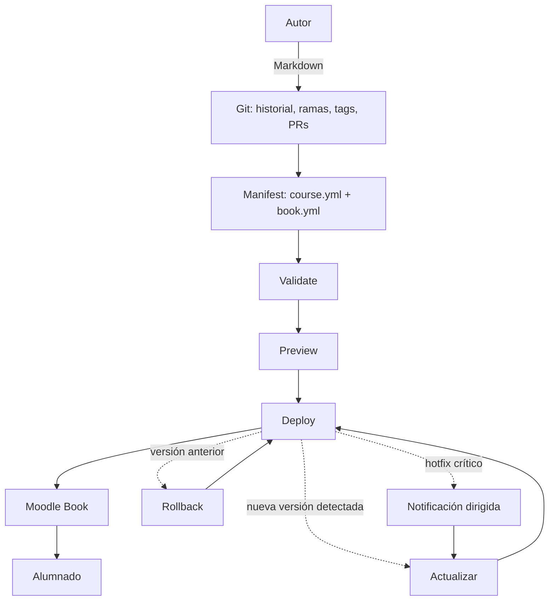
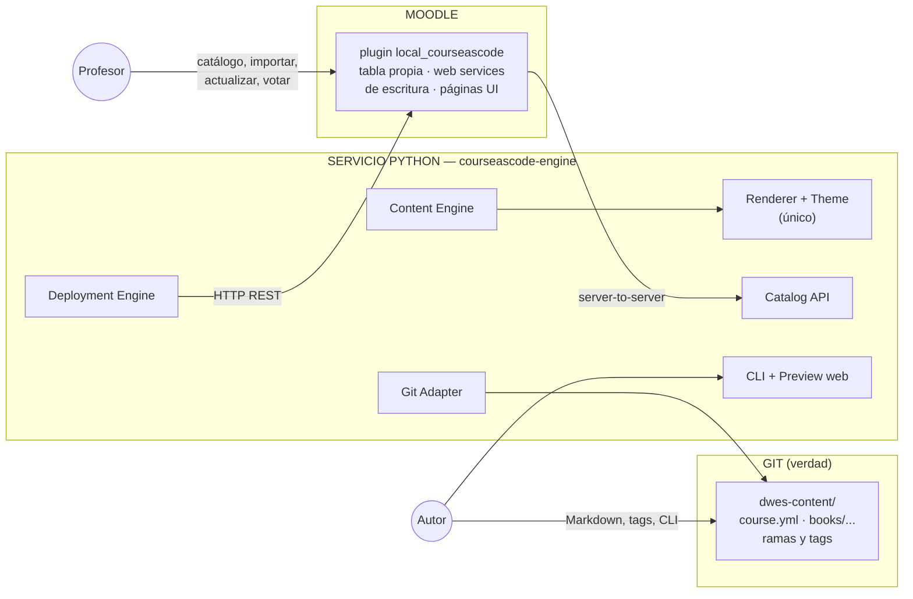
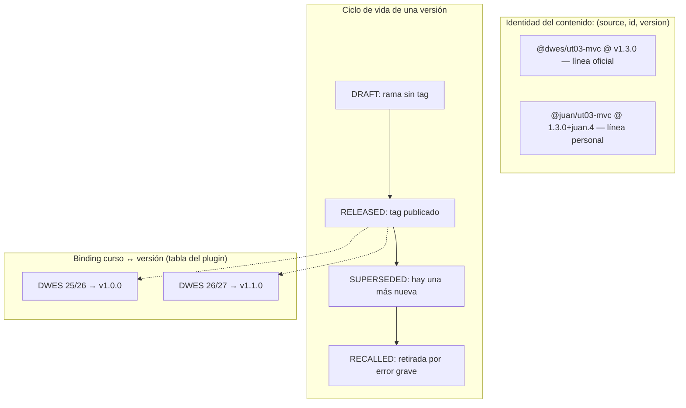

# Moodle Course as Code

Definir cursos Moodle mediante archivos versionados en Git y usar Moodle como
plataforma de despliegue. **Git es la fuente de verdad del contenido docente;
Moodle es la plataforma de publicación y ejecución.** Moodle nunca se convierte
en el editor principal del contenido.

- **Especificación vigente:** [docs/Especificación Moodle Course as Code v0.2.md](docs/Especificación%20Moodle%20Course%20as%20Code%20v0.2.md)
- **Bitácora de desarrollo (estado actual):** [BITACORA.md](BITACORA.md)
- **Estado:** Fase 0 del engine completada — ver [BITACORA.md](BITACORA.md).

## El flujo completo



## Arquitectura: tres piezas



**Regla de oro:** toda la lógica vive en el servicio Python. El plugin Moodle es
deliberadamente "tonto": expone operaciones atómicas (crear capítulo, subir
archivo, registrar despliegue) y pinta pantallas. Un solo renderer compartido por
preview y despliegue (*preview = producción*).

## Identidad, versionado y despliegue



- **Importar = vincular, no copiar.** Importar un Book declara una dependencia
  ("este curso usa `@dwes/ut03-mvc` en la versión X"); el contenido sigue en Git.
- **Versiones inmutables:** un tag publicado jamás se mueve; los errores se
  corrigen *forward* con una versión nueva (p. ej. hotfix `v1.3.1` que deja
  `v1.3.0` en `RECALLED`).
- **Gobernanza colegiada:** repo único privado, `main` protegida, todo cambio por
  PR con quórum del consejo de curadores (configurado con las funciones nativas
  de GitHub/GitLab: ramas protegidas, *required approvals*, `CODEOWNERS`, checks
  CI bloqueantes). Las ramas personales son territorio libre.

## Estructura del repositorio de contenidos

```text
dwes-content/
├── course.yml              # id, title, books[]
├── books/
│   └── ut03-mvc/
│       ├── book.yml        # id, title, chapters[] (ids estables)
│       ├── 01-introduccion.md
│       ├── 02-mvc.md
│       └── assets/
└── README.md
```

Regla de contenido: solo material **publicable ante alumnado**. Exámenes,
soluciones y bancos de preguntas no viven en este repo.

## Este repositorio

```text
├── engine/                 # courseascode-engine (Python 3.12, src-layout)
│   ├── src/courseascode/
│   │   ├── domain/         # modelos puros (SemVer, ContentId, DeploymentPlan…)
│   │   ├── manifests/      # course.yml / book.yml
│   │   ├── git/            # GitProvider + LocalGitProvider
│   │   ├── content/        # renderer único + temas
│   │   ├── catalog/        # catálogo derivado del repo
│   │   ├── deployment/     # planner + executor idempotentes
│   │   ├── moodle/         # MoodleProvider + cliente REST
│   │   ├── api/            # FastAPI (endpoints del plugin)
│   │   ├── web/            # preview local
│   │   └── cli/            # Typer
│   └── tests/
├── docs/                   # especificación, diagramas de secuencia, tasklist
├── BITACORA.md             # estado del desarrollo (actualizar cada sesión)
└── .github/workflows/      # CI del engine (ruff + mypy strict + pytest)
```

## Desarrollo del engine

Requisitos: Python 3.12. En `engine/`:

```bash
python3.12 -m venv .venv && source .venv/bin/activate
pip install -e .[dev]
make check          # ruff + ruff format --check + mypy --strict + pytest
courseascode --help # CLI (Fase 0: comandos como stubs)
```

Las credenciales nunca se commitean; el CLI falla ruidosamente si faltan las
variables `MOODLE_URL`, `MOODLE_TOKEN`, `CONTENT_REPO_URL`, `CONTENT_REPO_KEY` (§25).

El desarrollo se organiza en 10 fases (`ENG-001`–`ENG-106`) con milestones M1–M4
según la [tasklist](docs/Tasklist%20—%20Desarrollo%20courseascode-engine.md). El
plugin Moodle `local_courseascode` es una pista paralela cuyo hito crítico
(tabla + `upsert_book/chapter` + token) debe estar listo antes de terminar la
Fase 6 del engine.

## Validación por usuarios

La Beta se considera terminada cuando los 13 criterios de aceptación (§32 de la
spec) pasen de forma automatizada en CI:

1. Crear un Book (`book.yml` + 5 capítulos Markdown + assets) y validarlo.
2. Previsualizarlo con el tema propio.
3. Etiquetar `book/ut03-mvc/v1.0.0`.
4. Un profesor importa desde el catálogo de Moodle a un curso vacío.
5. El Book aparece en Moodle con imágenes y enlaces internos funcionando.
6. Se publica `v1.1.0`; Moodle muestra `UPDATE AVAILABLE`.
7. El profesor ve el plan de cambios y actualiza.
8. El mismo Book se actualiza sin duplicados.
9. Rollback a `v1.0.0` restaura el estado exacto.
10. Un PR a `main` sin `validate` en verde no puede mergearse.
11. Un PR MINOR requiere 2 aprobaciones.
12. Marcar una versión como `critical` muestra el aviso en los cursos afectados.
13. Los nuevos despliegues de la versión retirada quedan bloqueados.

## Documentación

- [Especificación Beta 0.2](docs/Especificación%20Moodle%20Course%20as%20Code%20v0.2.md) — alcance, principios, arquitectura, gobernanza, ciclo de vida, criterios de aceptación.
- [Diagramas de secuencia (Mermaid)](docs/Diagramas%20de%20secuencia%20—%20Moodle%20Course%20as%20Code.md) — S1–S10: importación, deploy, actualización, gobernanza, hotfix, rollback, preview, drift, export, validación en PR.
- [Tasklist del engine](docs/Tasklist%20—%20Desarrollo%20courseascode-engine.md) — fases ENG-001–ENG-106 con DoD por fase.
- [Bitácora](BITACORA.md) — progreso real y registro de sesiones.

## Licencia

GPL-3.0-or-later (ver [LICENSE](LICENSE)).
