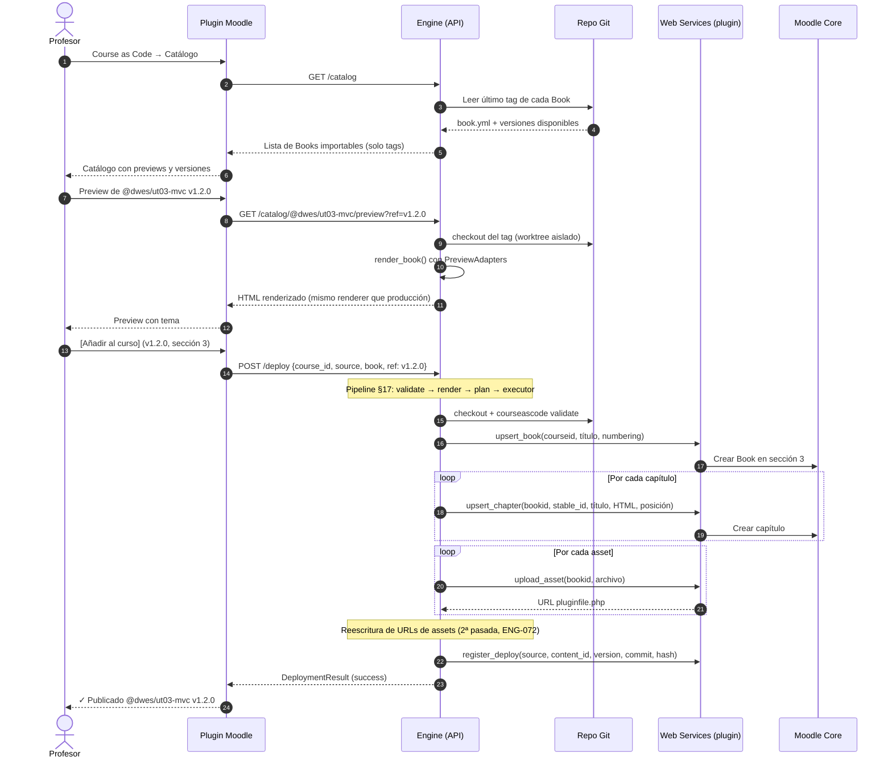
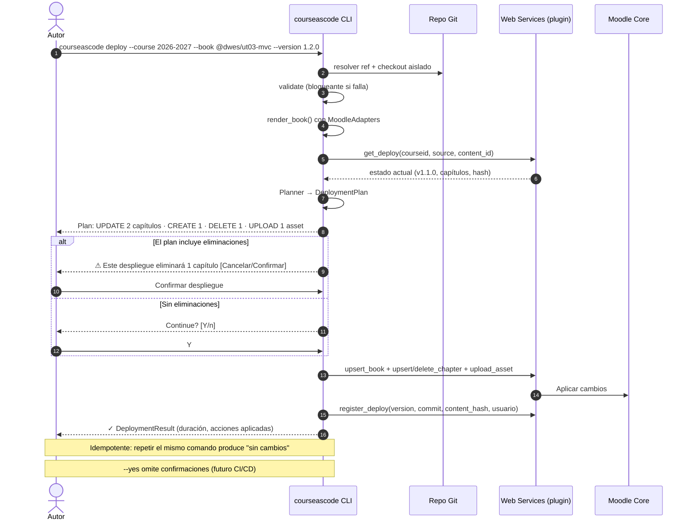
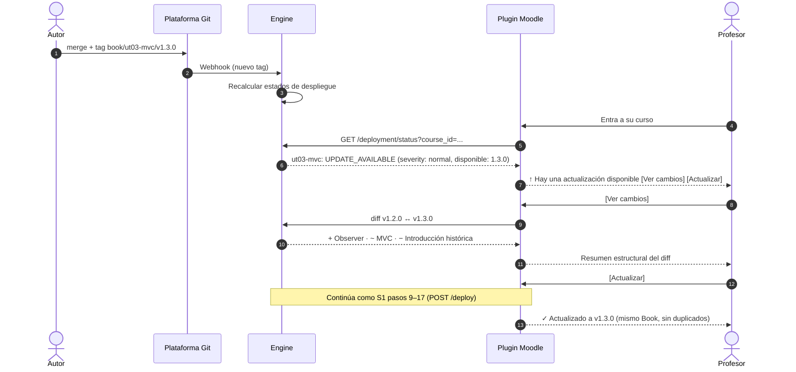
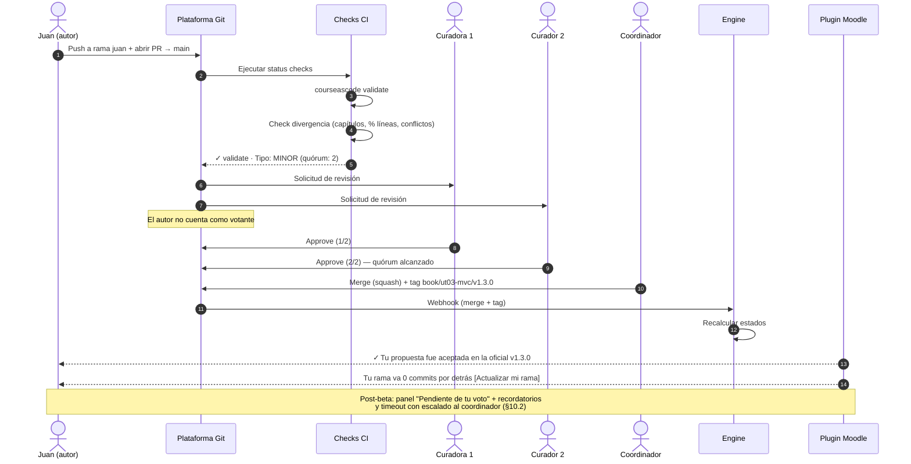
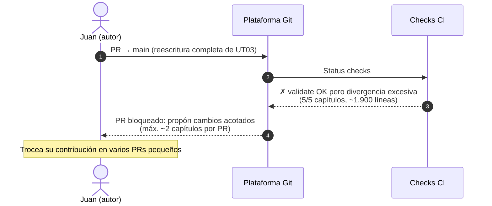
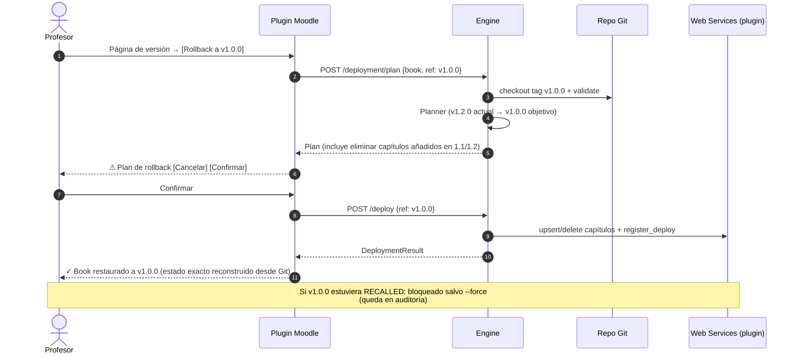
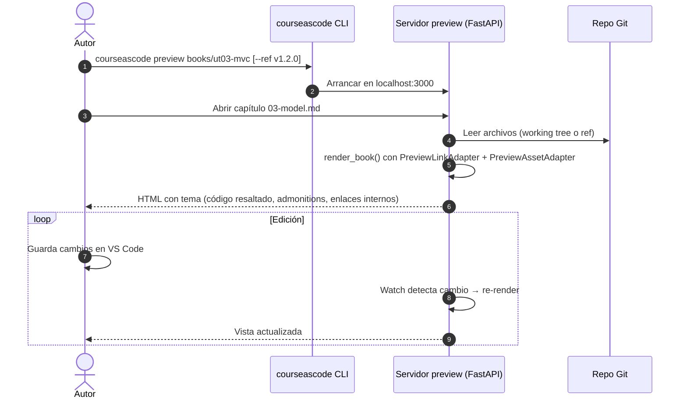
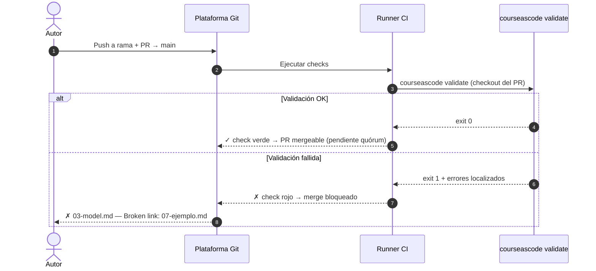

# Diagramas de secuencia — Moodle Course as Code (Beta 0.2)

> Diagramas de los flujos funcionales de la Especificación Beta 0.2, en Mermaid
> (se renderizan en GitHub/GitLab/Obsidian/Typora). Actores y participantes:
>
> - **Profesor / Autor / Coordinador / Curadores**: roles humanos (§3 spec).
> - **Plugin Moodle** (`local_courseascode`): páginas UI + web services de escritura.
> - **Engine** (`courseascode-engine`): servicio Python (API + CLI + renderer).
> - **Repo Git**: repositorio de contenidos.
> - **Plataforma Git**: GitHub/GitLab (PRs, checks, webhooks).
> - **Moodle Core**: tablas y APIs estándar de Moodle.

---

## S1. Importación desde el catálogo (profesor desde cero)

Flujo principal del §12 de la spec: el profesor descubre un Book, lo previsualiza
y lo importa a su curso sin tocar Git.



---

## S2. Deploy desde CLI (autor técnico)

Mismo pipeline que S1, disparado desde terminal (§17). Incluye plan de despliegue
con confirmación y protección ante borrados (§17.1–17.3).



---

## S3. Detección de actualización y actualización desde Moodle

El profesor ve `UPDATE_AVAILABLE` y actualiza con un clic (§19, §21).



---

## S4. Gobernanza: PR con quórum sobre `main`

Contribución de un profesor a la línea oficial (§10). La gobernanza se ejecuta en
la plataforma Git; el plugin observa y notifica.



### Variante S4b: PR bloqueado



---

## S5. Hotfix crítico

Error grave en una versión desplegada en varios cursos (§11). Forward-fix +
severidad + notificación dirigida; el profesor decide.

```mermaid
sequenceDiagram
    autonumber
    actor CO as Coordinador
    participant GH as Plataforma Git
    participant EN as Engine
    participant PL as Plugin Moodle
    actor P as Profesor (curso afectado)

    Note over CO,GH: v1.3.0 desplegada en 20 cursos; se detecta error grave
    CO->>GH: PR hotfix (carril rápido: 1 aprobación, validate bloqueante)
    GH->>GH: Merge + tag v1.3.1 (forward-fix; v1.3.0 jamás se toca)
    CO->>EN: courseascode release mark v1.3.0<br/>--severity critical --fixed-in v1.3.1 --reason "..."
    EN->>EN: Registrar Release (auditoría) + consulta inversa:<br/>¿qué cursos tienen v1.3.0?

    P->>PL: Entra a su curso
    PL->>EN: GET /deployment/status?course_id=...
    EN-->>PL: UPDATE_AVAILABLE (severity: CRITICAL, fix: 1.3.1)
    PL-->>P: ⚠ ACTUALIZACIÓN CRÍTICA<br/>"El ejemplo contenía SQL inseguro"<br/>[Ver corrección] [Actualizar a 1.3.1] [Actualizar en mis 3 cursos]

    P->>PL: [Actualizar a 1.3.1]
    Note over PL,EN: Pipeline de deploy estándar (S1, pasos 9–17)
    PL-->>P: ✓ Actualizado a v1.3.1

    Note over CO,PL: Nuevos despliegues de v1.3.0 (RECALLED) quedan bloqueados.<br/>Los cursos que no actualicen conservan su contenido: el sistema nunca toca<br/>unilateralmente lo que el alumnado está viendo.
```

---

## S6. Rollback

Volver a una versión anterior = redeploy desde Git (§18). Nunca restauración de
copias de Moodle.



---

## S7. Preview local (autor)

Preview = producción: mismo renderer, adapters distintos (§13).



---

## S8. Detección de drift (edición manual en Moodle)

Un profesor edita el Book a mano; el sistema lo detecta antes de sobrescribir (§19.1).

```mermaid
sequenceDiagram
    autonumber
    actor P as Profesor
    participant MC as Moodle Core
    participant PL as Plugin Moodle
    participant EN as Engine

    P->>MC: Edita un capítulo del Book a mano
    Note over MC: El HTML ya no coincide con content_hash registrado

    P->>PL: [Actualizar a v1.3.0] (días después)
    PL->>EN: POST /deployment/plan
    EN->>PL: (vía get_deploy + HTML actual) comparar hashes
    EN-->>PL: Plan + DRIFT_DETECTED
    PL-->>P: ⚠ Este Book fue modificado manualmente en Moodle.<br/>El despliegue sobrescribirá esos cambios.<br/>[Ver diferencias] [Desplegar de todos modos] [Cancelar]

    alt Desplegar de todos modos
        P->>PL: Confirmar
        Note over PL,EN: Deploy estándar; nuevo content_hash registrado
    else Cancelar
        P->>PL: Cancelar (sin cambios)
    end
```

---

## S9. Export del estado de despliegues

`deployments.yml` como vista exportable para reproducibilidad/auditoría (§9).

```mermaid
sequenceDiagram
    autonumber
    actor CO as Coordinador
    participant CLI as courseascode CLI
    participant WS as Web Services (plugin)
    participant GIT as Repo Git

    CO->>CLI: courseascode export --course 2026-2027
    CLI->>WS: list_deploys(courseid)
    WS-->>CLI: Bindings actuales (source, content_id, version, commit)
    CLI->>CLI: Generar deployments/2026-2027.yml
    CLI-->>CO: Fichero exportado
    CO->>GIT: Commit del export (auditoría histórica)
    Note over CO,GIT: El export es una VISTA; la fuente de verdad del binding<br/>sigue siendo la tabla del plugin
```

---

## S10. Validación como status check en PR

`main` siempre desplegable: la validación corre en CI sobre cada PR (§10.2, §20).



---

## Resumen de correspondencia con la spec v0.2

| Diagrama | Secciones de la spec |
|---|---|
| S1 Importación desde catálogo | §12, §17 |
| S2 Deploy desde CLI | §17, §29 |
| S3 Detección y actualización | §19, §21, §22 |
| S4 Gobernanza PR + quórum | §10, §27 |
| S5 Hotfix crítico | §11 |
| S6 Rollback | §18 |
| S7 Preview local | §13, §14 |
| S8 Drift | §19.1 |
| S9 Export | §9 |
| S10 Validación en PR | §10.2, §20 |
